# 编译原理实验报告

## 实验一

### 设计方案

#### 功能模块结构图

词法分析器程序文件为 `lex.py`，其有以下模块，蓝色为全局变量，黄色为主要功能函数

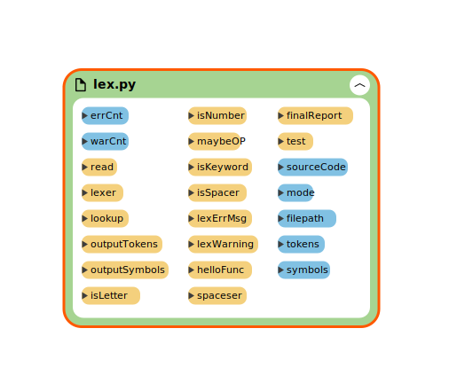

#### 主体结构流程图

对于词法分析器，主要功能是读入源代码字符串流，输出 Token 流和符号表。其中 `lexer` 函数是主要程序，其结构为

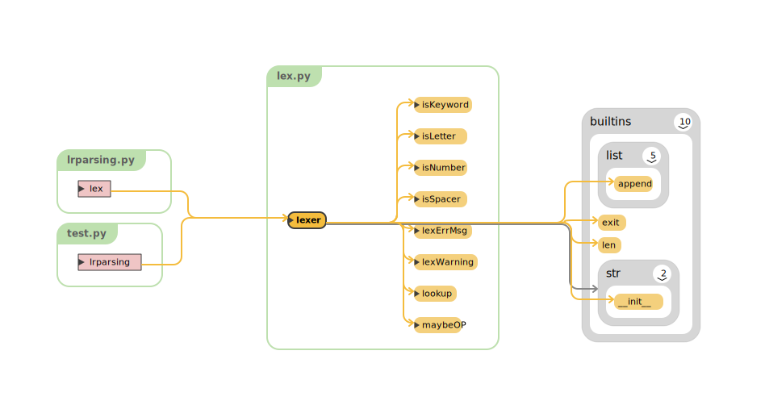

对于其调用的函数，依赖图为：

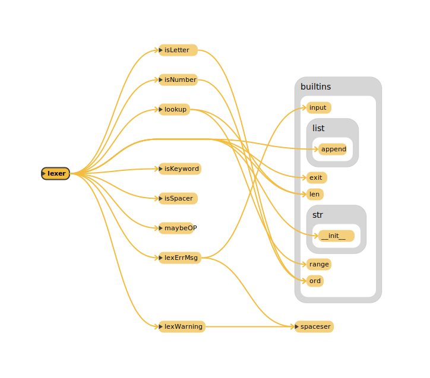

#### 主要数据结构

- 符号表，在扫描的同时生成并维护，示例代码的符号表如下
```json
{'addr': '0', 'value': 'a', 'type': 'id', 'line': 1, 'cur': 7}
{'addr': '1', 'value': 'b', 'type': 'id', 'line': 2, 'cur': 7}
{'addr': '2', 'value': 'c', 'type': 'id', 'line': 3, 'cur': 7}
{'addr': '3', 'value': '2', 'type': 'digits', 'line': 4, 'cur': 7}
{'addr': '4', 'value': '1', 'type': 'digits', 'line': 5, 'cur': 7}
```
- Token串，边识别边维护，示例代码部分 Token 串如下，其中保留行和光标位置用于报错和警告提示
```json
["Keyword", "int", {"line": 1, "cur": 5}]
["id", "0", {"line": 1, "cur": 7}]
["OP", ";", {"line": 2, "cur": 1}]
["Keyword", "int", {"line": 2, "cur": 5}]
["id", "1", {"line": 2, "cur": 7}]
["OP", ";", {"line": 3, "cur": 1}]
["Keyword", "int", {"line": 3, "cur": 5}]
["id", "2", {"line": 3, "cur": 7}]
["OP", ";", {"line": 4, "cur": 1}]
["id", "0", {"line": 4, "cur": 3}]
["OP", "=", {"line": 4, "cur": 5}]
["digits", "3", {"line": 4, "cur": 7}]
["OP", ";", {"line": 5, "cur": 1}]
["id", "1", {"line": 5, "cur": 3}]
```

#### 开发平台

- Python 3.9.8 on Darwin arm64
```
Python 3.9.8 (main, Nov 10 2021, 03:48:35)
[Clang 13.0.0 (clang-1300.0.29.3)] on darwin for arm
```

- 额外依赖包：无

### 具体实现

- `read`
对于词法分析器首先需要扫描源文件到缓冲区，可以使用直接从标准输入输出
```py
def read(**kwargs):
    content = ""
    if "mode" in kwargs and kwargs["mode"] == 'file':
        if "filepath" in kwargs and kwargs["filepath"] is None:
            print("Error:", "Empty File Path.")
            return False
        try:
            f = open(kwargs["filepath"])
        except:
            print("Error:", "Open file failed, please confirm your filepath is right.")
            return False

        content = f.read()
    else:
        print("Please input your code HERE ,press 'EOF' and ENTER to end your input!")
        print(">>> ", end="")
        tmp = ""
        while tmp != "EOF":
            tmp = input()
            print(">>> ", end="")
            if tmp != "EOF":
                content += tmp+"\n"
        print("")
    return content
```

- 辅助判断函数
```
isLetter 	# 判断某个符号是否为 Letter
isNumber	# 判断某个符号是否为 Number
lookup		# 查询符号是否在符号表中存在
isKeyword	# 判断某符号是否为关键字
isSpacer	# 判断某符号是否为空，可省略
maybeOP		# 判断某符号是否可能为操作符 (双字操作符)
```

- 错误和警告处理

错误处理：当发生错误时调用该函数，该函数会接受当前光标所在位置和错误信息，将错误显示给用户，并且会请求用户如何处理该错误信息，如果用户选择跳过，则会启动恐慌模式，删除掉错误信息尝试恢复

```python
def lexErrMsg(cur=0, line=0, content=""):
    global errCnt
    errCnt += 1
    spaceser()
    print(
        f"Error {errCnt}:", f"there's a error at line {line} cur {cur} which is:")

    print(content)
    print("Please check your code, ignore it and continue? (Y/N): ", end="")
    while True:
        opt = input("")
        if opt == "Y":
            print("Ignore this error, continue process...")
            spaceser()
            return True
        elif opt == "N":
            print("Error, Exit process...")
            spaceser()
            return False
        else:
            print("Please input Y/N:", end="")
```

警告处理：当用户未按要求严格输入但可能不对编译结果造成影响时词法分析器会使用该函数提醒用户，并指出错误位置，但不会打断编译流程，会继续处理直到编译完成

```python
def lexWarning(cur=0, line=0, content=""):
    global warCnt
    warCnt += 1
    spaceser()
    print(f"Warning {warCnt}:",
          f"There's a warning at line {line} cur {cur} which is:")
    print(content)
    print("Vaala's Lexer try to continue, the ans may be not right, check your code.")
    spaceser()
```

- `lexer`

该实验的主要工作是由该函数负责，该函数接受源代码输入，输出 token 和 符号表，工作流程为：
```python
def lexer(sourceCode):
	# 1. 添加结束符
	# 2. 识别关键词
	# 3. 识别符号
	# 4. 识别id
	# 5. 识别digits
```
除关键词识别使用直接匹配外，其它文法符号的识别均使用自动机完成，下面给出自动机状态图：

- id
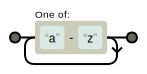
- digits
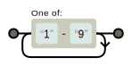

具体实现流程参见主干代码
```python
def lexer(sourceCode):
    # 添加结束符
    sourceCode += "$"
    finalTokens = []
    symbols = []
    previousLetters = ""
    # cnt,line用于错误提示定位
    cnt = 1
    line = 1
    for i in sourceCode:
        cnt += 1
        if i == "\n":
            line += 1
            cnt = 1
        # 关键词是最优先的
        if isKeyword(previousLetters):
            finalTokens.append(["Keyword", previousLetters,
                               {"line": line, "cur": cnt}])
            previousLetters = ""
        # 首先是OP,先处理单个无后继符号
        if previousLetters == "":
            # 读到这几个符号那一定是独立符号，直接存
            if i == "+" or i == "-" or i == "*" or i == "/" or i == ";" or i == "(" or i == ")" or i == "'":
                finalTokens.append(["OP", i, {"line": line, "cur": cnt}])
                continue
            # 这几个符号可能有后继，需要先存着给后面
            elif i == "<" or i == "=" or i == ">" or i == "!":
                previousLetters += i
                continue
        # 然后处理可能有后续的符号
        elif previousLetters == "<" or previousLetters == "=" or previousLetters == "<" or previousLetters == "!":
            # 如果是等号那组合起来就是OP
            if i == "=":
                previousLetters += i
                finalTokens.append(
                    ["OP", previousLetters, {"line": line, "cur": cnt}])
                previousLetters = ""
                continue
            # 后面是空格或者字符/数字，就存了
            elif isSpacer(i) or isLetter(i) or isNumber(i):
                finalTokens.append(
                    ["OP", previousLetters, {"line": line, "cur": cnt}])
                if not isSpacer(i):
                    previousLetters = i
                else:
                    previousLetters = ""
                continue
            # 如果后面不是等号或者合法的跟随字，那就报错并询问要不要跳过它继续处理
            else:
                # 如果选择跳过，那就清空记录，并且下一个词
                if lexErrMsg(cnt, line, previousLetters):
                    previousLetters = ""
                    continue
                # 如果选择不跳过，那就错误退出
                else:
                    exit(1)
        # 最后处理前面传来的OP
        elif maybeOP(previousLetters):
            finalTokens.append(
                ["OP", previousLetters, {"line": line, "cur": cnt}])
            if not isSpacer(i):
                previousLetters = i
            else:
                previousLetters = ""
            continue
        # 到这里OP就处理完了，接下来处理id
        # id是单个letter或letter组合
        # 如果刚开始读就直接开始处理
        if previousLetters == "":
            # 读到字母就继续
            if isLetter(i):
                previousLetters += i
                continue
        # 只需要检测前一个符号是不是字母
        elif isLetter(previousLetters[-1]):
            if isLetter(i):
                previousLetters += i
                continue
            # 读到空格或符号代表终结
            elif isSpacer(i) or maybeOP(i):
                # 如果没填过这个符号
                idx = lookup(symbols, previousLetters)
                if idx == -1:
                    addr = len(symbols)
                    symbols.append(
                        {"addr": str(addr), "value": previousLetters, "type": "id", "line": line, "cur": cnt})
                    idx = addr
                finalTokens.append(
                    ["id", str(idx), {"line": line, "cur": cnt}])
                if maybeOP(i):
                    previousLetters = i
                else:
                    previousLetters = ""
                continue
            # 读到其它东西先报个Warning然后存token
            else:
                lexWarning(cnt, line, previousLetters+i)
                idx = lookup(symbols, previousLetters)
                if idx == -1:
                    addr = len(symbols)
                    symbols.append(
                        {"addr": str(addr), "value": previousLetters, "type": "id", "line": line, "cur": cnt})
                    idx = addr
                finalTokens.append(
                    ["id", str(idx), {"line": line, "cur": cnt}])
                previousLetters = i
                continue
        # id处理完过后我们来处理digits
        # 首先处理缓冲区没东西的情况
        if previousLetters == "":
            if isNumber(i):
                previousLetters += i
                continue
        # 只需要判断前一个符号是不是数字
        elif isNumber(previousLetters[-1]):
            # 如果当前符号是数字那就继续
            if isNumber(i):
                previousLetters += i
                continue
            # 如果是空格或者符号那就存
            elif isSpacer(i) or maybeOP(i):
                addr = len(symbols)
                symbols.append(
                    {"addr": str(addr), "value": previousLetters, "type": "digits", "line": line, "cur": cnt})
                finalTokens.append(
                    ["digits", str(addr), {"line": line, "cur": cnt}])
                if maybeOP(i):
                    previousLetters = i
                else:
                    previousLetters = ""
                continue
            # 如果读到其它东西报Warning然后存
            else:
                lexWarning(cnt, line, previousLetters+i)
                addr = len(symbols)
                symbols.append(
                    {"addr": str(addr), "value": previousLetters, "type": "digits", "line": line, "cur": cnt})
                finalTokens.append(
                    ["digits", str(addr), {"line": line, "cur": cnt}])
                previousLetters = i
                continue
    return [finalTokens, symbols]
```

### 总结反思

本次试验使用 python 并且没有调用第三方依赖实现了一个小型简单的词法分析器，让我体会到了形式语言和编译原理的深奥，激发了我对计算机科学的兴趣，由于实验一较为基础简单，并没有碰到特别的问题。

## 实验二

### 设计方案

#### 功能模块结构图

对于语法分析器，需要产生 SLR 分析表和状态转换图，各个函数模块功能图如下，蓝色为全局变量或表，黄色为函数功能模块

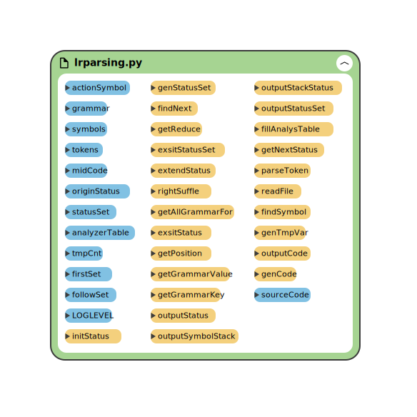

#### 主体结构流程图

对于语法分析器，重点是 LR 表的生成和分析栈的维护

- LR 表生成流程图，组件名称 `genStatusSet`

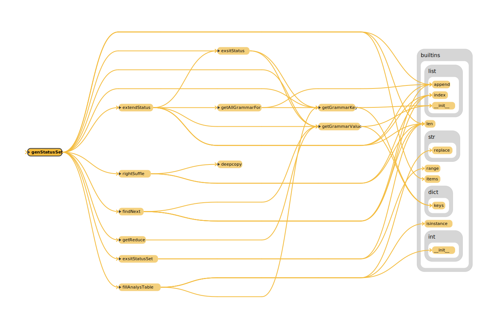

- 分析栈的维护，组件名称 `parseToken`，功能模块如下

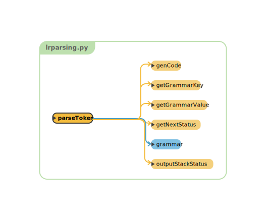

对于使用到的函数，流程图如下

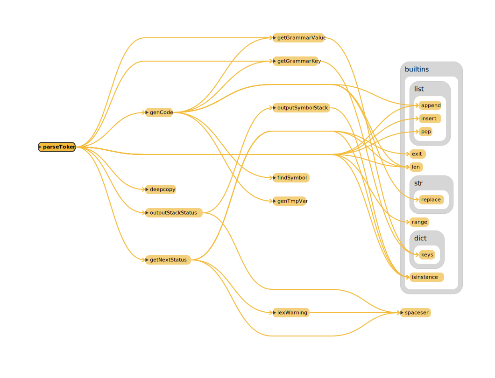

#### 主要数据结构

LR 语法分析需要构造 SLR 分析表，但附录中给出的文法不是 SLR 文法，所以需要对其进行改造，在经过改造后输出的数据结构有：

- SLR 分析表，取部分，见下方

```
0 : {'P': [1], 'M': [2]}
1 : {'$': ['ACCEPT', 'r0']}
5 : {'id': ['r4']}
6 : {'id': ['r5']}
3 : {'S': [7], 'id': [8], 'if': [9], 'while': [10]}
7 : {'$': ['r1'], 'M': [12]}
4 : {'id': [11]}
8 : {'=': [13]}
9 : {'(': [14]}
11 : {';': [16]}
12 : {'S': [17], 'id': [8], 'if': [9], 'while': [10]}
```

开头数字代表状态，后面的符号代表接收到符号转移到某个状态，当数组中存在两个元素时代表冲突，需要调用错误处理函数。

- 状态集族，取一部分，见下方

```
0 [{'P_': ['.', 'P']}, {'P': ['.', 'M', 'D', 'S']}, {'M': ['.']}]
1 [{'P_': ['P', '.']}]
2 [{'P': ['M', '.', 'D', 'S']}, {'D': ['.']}, {'D': ['.', 'L', 'id', ';', 'N', 'D']}, {'L': ['.', 'int']}, {'L': ['.', 'float']}]
3 [{'P': ['M', 'D', '.', 'S']}, {'S': ['.', 'id', '=', 'E', ';']}, {'S': ['.', 'if', '(', 'C', ')', 'M', 'S']}, {'S': ['.', 'if', '(', 'C', ')', 'M', 'S', 'N', 'else', 'M', 'S']}, {'S': ['.', 'while', 'M', '(', 'C', ')', 'M', 'S']}, {'S': ['.', 'S', 'M', 'S']}]
4 [{'D': ['L', '.', 'id', ';', 'N', 'D']}]
5 [{'L': ['int', '.']}]
6 [{'L': ['float', '.']}]
7 [{'P': ['M', 'D', 'S', '.']}, {'S': ['S', '.', 'M', 'S']}, {'M': ['.']}]
8 [{'S': ['id', '.', '=', 'E', ';']}]
9 [{'S': ['if', '.', '(', 'C', ')', 'M', 'S']}, {'S': ['if', '.', '(', 'C', ')', 'M', 'S', 'N', 'else', 'M', 'S']}]
10 [{'S': ['while', '.', 'M', '(', 'C', ')', 'M', 'S']}, {'M': ['.']}]
11 [{'D': ['L', 'id', '.', ';', 'N', 'D']}]
```
前面数字代表状态，后面符号代表每个项目的状态

- 分析栈，取部分，见下方

```
=========================================================
symbolStacks: [$, D, S, ]
statusStacks: [0, 2, 6]
useReduce: {'S': ['S', 'S']}
=========================================================
symbolStacks: [$, D, ]
statusStacks: [0, 2]
useReduce: {'S': ['S', 'S']}
=========================================================
symbolStacks: [$, D, S, ]
statusStacks: [0, 2, 6]
useReduce: {'S': ['S', 'S']}
=========================================================
symbolStacks: [$, D, ]
statusStacks: [0, 2]
useReduce: {'P': ['D', 'S']}
=========================================================
symbolStacks: [$, ]
statusStacks: [0]
useReduce: {'P': ['D', 'S']}
=========================================================
symbolStacks: [$, P, ]
statusStacks: [0, 1]
useReduce: {'P': ['D', 'S']}
ACCEPT
```
最后ACCEPT表示接受输入，中途如果有未定义的行为则会调用实验一中的报错函数进行处理。

#### 开发平台

- Python 3.9.8 on Darwin arm64
```
Python 3.9.8 (main, Nov 10 2021, 03:48:35)
[Clang 13.0.0 (clang-1300.0.29.3)] on darwin for arm
```

- 额外依赖包：无

### 具体实现

LR 语法分析的主要任务是生成状态集族和分析表，使用分析栈对 Token 串进行识别与归约

- 状态集族的生成

```python
def genStatusSet(statusCur):
    global statusSet
    if statusCur == len(statusSet):
        return
    # 首先是要拓展该状态
    extedStatus = extendStatus(statusSet[statusCur])
    statusSet[statusCur] += extedStatus
    # 然后是要找出产生式右部的点的右边的符号，将对应的项集点全部右移后变成新状态
    nextSymbol = findNext(statusSet[statusCur])
    nextSymbolMap = {}
    for i in nextSymbol:
        if i["next"] not in nextSymbolMap:
            nextSymbolMap[i["next"]] = []
        nextSymbolMap[i["next"]].append(i["idx"])
    # 如果没有下一个符号
    if nextSymbolMap == {} and getGrammarValue(statusSet[statusCur][0])[-1] == ".":
        # 读到P代表已经接受了
        if getGrammarKey(statusSet[statusCur][0]) == "P_":
            fillAnalysTable(statusCur, "$", ".")
        else:
            tmpK = getGrammarKey(statusSet[statusCur][0])
            tmpV = getGrammarValue(statusSet[statusCur][0])[:-1]
            fillAnalysTable(statusCur, "$", f"r{getPosition({tmpK: tmpV})}")
    tmpReduceG = getReduce(statusSet[statusCur])
    if tmpReduceG != {} and statusCur != 0:
        tmpK = getGrammarKey(tmpReduceG)
        tmpV = getGrammarValue(tmpReduceG)[:-1]
        if len(tmpV) == 0:
            tmpV = [""]
        fillAnalysTable(statusCur, "$", f"r{getPosition({tmpK: tmpV})}")
    # k是下一个符号，v是状态中对应产生式的序号表
    for k, v in nextSymbolMap.items():
        tmpStatus = []
        rG = {}
        # 将接受一个符号都能转移到下一步的项目合在一起右移，并且在不存在重复状态时加入项目集，i代表一个序号
        for i in v:
            tmpV = rightSuffle(getGrammarValue(statusSet[statusCur][i]))
            tmpK = getGrammarKey(statusSet[statusCur][i])
            # 如果产生了可归约情况，那么记录归约的产生式
            if tmpV[-1] == ".":
                if len(tmpV) == 1:
                    rG = {tmpK: [""]}
                else:
                    rG = {tmpK: tmpV[0:-1]}
            if not exsitStatus(tmpStatus, {tmpK: tmpV}):
                tmpStatus.append({tmpK: tmpV})
            else:
                continue
        # tmpStatus代表当前状态接受符号k，转移到的下一个状态
        tmpStatus += extendStatus(tmpStatus)
        # 我们需要在分析表中记录这个跳转
        # 对于可归约情况我们需要进行特判
        nxtCur = exsitStatusSet(tmpStatus)
        if -1 == nxtCur:
            # 如果是新状态，那么新状态序号就是statusSet没有append之前的长度
            fillAnalysTable(statusCur, k, len(statusSet))
            # 如果产生的新状态可归约，那么需要填写新状态的可归约情况
            if rG != {}:
                fillAnalysTable(len(statusSet), getGrammarValue(rG)[-1],
                                f"r{getPosition(rG)}")
            statusSet.append(tmpStatus)
        # 如果不是新状态，那么就是查找函数返回的位置
        else:
            fillAnalysTable(statusCur, k, nxtCur)
    genStatusSet(statusCur+1)
```

递归的使用该函数对每个状态进行拓展和归约，其中较为重要的拓展函数 `extendStatus` 代码如下

```python
# 从当前状态拓展点后面的状态，也就是把点后面的非终结符号（在这里是大写字母）加入项集中，还要比较是不是已经有相同的状态在里面
def extendStatus(status):
    ansStatus = []
    for i in status:
        # 找到点后面的符号
        dotCur = getGrammarValue(i).index(".")
        if dotCur != len(getGrammarValue(i))-1:
            k = getGrammarValue(i)[dotCur+1][0]
            extStatus = getAllGrammarFor(k)
            # 判断每一条拓展后的项目是否已经存在
            for i in extStatus:
                if not exsitStatus(status, i):
                    ansStatus.append(i)
        else:
            continue
    if len(ansStatus) == 0:
        return []
    return ansStatus+extendStatus(ansStatus)
```

在生成状态集族的同时也会进行 SLR 分析表的构造：
```python
def genStatusSet(statusCur):
    ...
    ...
    if nextSymbolMap == {} and getGrammarValue(statusSet[statusCur][0])[-1] == ".":
        # 读到P代表已经接受了
        if getGrammarKey(statusSet[statusCur][0]) == "P_":
            fillAnalysTable(statusCur, "$", ".")
        else:
            ...
            ...
            fillAnalysTable(statusCur, "$", f"r{getPosition({tmpK: tmpV})}")
    tmpReduceG = getReduce(statusSet[statusCur])
    if tmpReduceG != {} and statusCur != 0:
        tmpK = getGrammarKey(tmpReduceG)
        tmpV = getGrammarValue(tmpReduceG)[:-1]
        if len(tmpV) == 0:
            tmpV = [""]
        fillAnalysTable(statusCur, "$", f"r{getPosition({tmpK: tmpV})}")
        ...
        ...
        if -1 == nxtCur:
            # 如果是新状态，那么新状态序号就是statusSet没有append之前的长度
            fillAnalysTable(statusCur, k, len(statusSet))
            # 如果产生的新状态可归约，那么需要填写新状态的可归约情况
            if rG != {}:
                fillAnalysTable(len(statusSet), getGrammarValue(rG)[-1],
                                f"r{getPosition(rG)}")
        ...
        ...
        else:
            fillAnalysTable(statusCur, k, nxtCur)
    genStatusSet(statusCur+1)
```

其中每当出现新状态都会使用 `fillAnalysTable` 函数进行表的填写

```python
def fillAnalysTable(statusCur, inputSymbol, nextStatus):
    # LR分析表接受当前状态和文法符号的输入，按不同的情况有三种结果：
    # 1. 文法符号为非终结符，需要转移到对应状态
    # 2. 文法符号为终结符，但无法归约，需要转移到对应状态
    # 3. 文法符号为终结符，可以归约，进行归约
    # 首先将数据结构初始化
    global analyzerTable
    if statusCur not in analyzerTable:
        analyzerTable[statusCur] = {}
    # 然后填写状态表
    # 如果可以归约，将归约的产生式左部的follow集填写上归约标志
    if isinstance(nextStatus, str):
        if nextStatus == ".":
            analyzerTable[statusCur]["$"] = ["ACCEPT"]
            return
        tmpG = grammar[int(nextStatus.replace("r", ""))]
        tmpK = getGrammarKey(tmpG)
        for i in getFollow(tmpK):
            if i not in analyzerTable[statusCur]:
                analyzerTable[statusCur][i] = []
                analyzerTable[statusCur][i].append(nextStatus)
            else:
                if analyzerTable[statusCur][i][-1] == nextStatus:
                    continue
                else:
                    analyzerTable[statusCur][i].append(nextStatus)
        return
    if inputSymbol not in analyzerTable[statusCur]:
        analyzerTable[statusCur][inputSymbol] = []
    analyzerTable[statusCur][inputSymbol].append(nextStatus)
```

- 归约分析与分析栈的维护

在生成好项目集族和分析表后就可以使用 `parseToken` 进行分析了

```python
def parseToken(tokens):
    # 在得到项集族和分析表后，我们需要使用分析栈对Token串进行处理
    tokenBuffer = copy.deepcopy(tokens)
    # 我们先在输入流中加一个结束符
    tokenBuffer.append("$")
    # 创建符号栈和状态栈
    statusStacks = []
    symbolStacks = []
    # 初始化栈
    statusStacks.append(0)
    symbolStacks.append("$")
    # 在终结之前一直读取
    while len(tokenBuffer) > 0:
        tmpSymbol = tokenBuffer.pop(0)
        # LR表第一个括号是状态，第二个括号是输入
        nextStatus = getNextStatus(tmpSymbol, statusStacks[-1], mode="try")
        if isinstance(nextStatus, int):
            symbolStacks.append(tmpSymbol)
            statusStacks.append(nextStatus)
        if tmpSymbol == "ACCEPT":
            break
        outputStackStatus(symbolStacks, statusStacks, tmpSymbol)
        # 如果无法归约则读入符号，使用LR分析表转到对应状态
        # 归约在前面，如果可以归约就一直归约
        while True:
            if nextStatus == "ACCEPT":
                print("OHHHHHH!")
                break
            nextStatus = getNextStatus(
                tokenBuffer[0], statusStacks[-1], "try")
            if not isinstance(nextStatus, str):
                break
            if nextStatus == "ACCEPT":
                print("ACCEPT")
                break
            # 获取归约所用的文法
            tmpG = grammar[int(nextStatus[1:])]
            # 使用文法归约
            tmpK = getGrammarKey(tmpG)
            tmpV = getGrammarValue(tmpG)
            # 保存一下弹出来的符号
            reducedSymbols = []
            for i in range(len(tmpV)):
                # 依次弹栈
                if tmpV[0] != "":
                    tmpS = symbolStacks.pop()
                    statusStacks.pop()
                    reducedSymbols.insert(0, tmpS)
                    outputStackStatus(symbolStacks, statusStacks, tmpG)
            # 确定归约的规则后，使用对应的语义规则对其进行处理
            value = genCode(tmpG, reducedSymbols)
            # 弹完了记得把新的装进来，这里装进去多一个元素是为了携带信息
            symbolStacks.append(["mid", tmpK, value])
            nextStatus = getNextStatus(tmpK, statusStacks[-1])
            statusStacks.append(nextStatus)
            outputStackStatus(symbolStacks, statusStacks, tmpG)
```

在分析时遇到新的读入符号需要使用 `getNextStatus` 函数查分析表：
这个函数按照 token 的类型不同查询的方式也不同，并且在查询到错误信息和冲突信息后会使用报错函数对用户进行提醒，报错的位置就是当前查询 token 中存储的在原始代码中的行列值。

```python
def getNextStatus(token, statusCur, mode=""):
    kwd = []
    if isinstance(token, list):
        try:
            if token[0] == "Keyword":
                kwd = analyzerTable[statusCur][token[1]]
            elif token[0] == "OP":
                kwd = analyzerTable[statusCur][token[1]]
            elif token[0] == "id":
                kwd = analyzerTable[statusCur][token[0]]
            elif token[0] == "digits":
                kwd = analyzerTable[statusCur][token[0]]
            elif token[0] == "mid":
                kwd = analyzerTable[statusCur][token[1]]
            else:
                exit(1)
        except:
            if mode == "try":
                if LOGLEVEL >= 3:
                    print("INFO:", "Vaala's LR machine fix an Error at:")
                    print(
                        f"line {token[2]['line']} cur {token[2]['cur']}: {token[1]}")
                return []
            exit(1)
    else:
        if token in analyzerTable[statusCur]:
            kwd = analyzerTable[statusCur][token]
        else:
            return kwd
    if len(kwd) > 1:
        if isinstance(token, list):
            lex.lexWarning(token[2]["cur"], token[2]["line"], token[1])
    elif len(kwd) == 0:
        lex.spaceser()
        print("Fatal Error:",
              f"Your code is not allowed to compile!\n The error is line {kwd[2]['line']} cur {kwd[2]['cur']}:\n{kwd[1]}")
        exit(1)
    return kwd[0]
```

### 总结反思

在做实验时附录中文法的不规范是主要问题，因为没有啥意识到实验资料出错浪费了很多调试的事件，并且在修正后也需要对某些二义性情况进行特判，增加了我处理未知问题的能力，也非常的锻炼心态。并且项目集族和分析表的生成需要对某些边界情况严加考虑，否则调试时很难发现是在哪里出了错误。

## 实验三

### 系统功能分析与设计

由于语义分析于中间代码生成这两个步骤于语法分析严格绑定，所以内容有所简略。

实验要求使用 SDD 产生中间代码，语义分析于生成中间代码是在语法分析处理分析栈时每一步归约的时候处理的，为了将实验2、3分离，这里使用一个独立的函数，在归约的时候调用它，并将语义分析所需要的信息传递给他进行分析并产生中间代码，`genCode` 模块图如下

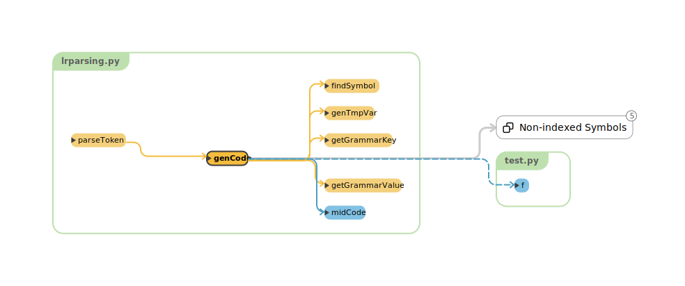

对于该模块的流程：

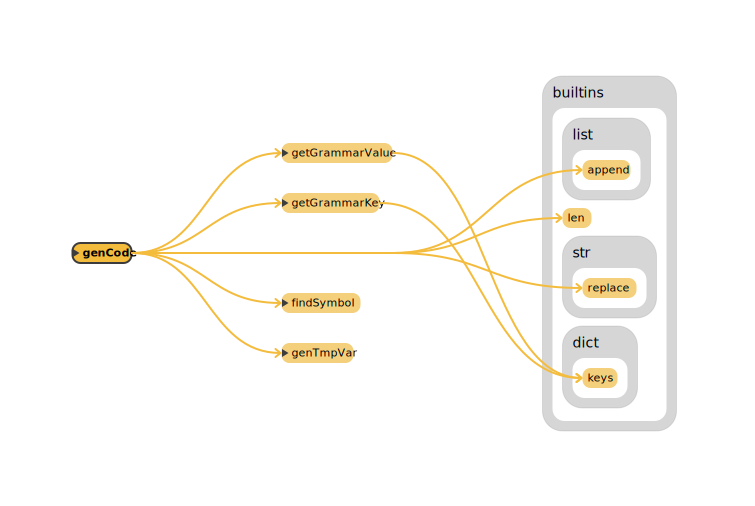

### 开发平台

- Python 3.9.8 on Darwin arm64
```
Python 3.9.8 (main, Nov 10 2021, 03:48:35)
[Clang 13.0.0 (clang-1300.0.29.3)] on darwin for arm
```

- 额外依赖包：无

### 语义翻译中使用的数据结构

对于语义翻译，根据实验二修正后但仍有二义性的文法具体规则如下
```
grammar = [
    {"P_": ["P"]},
    {"P": ["M", "D", "S"]},
    {"D": [""]},
    {"D": ["L", "id", ";", "N", "D"]},
    {"L": ["int"]},
    {"L": ["float"]},
    {"S": ["id", "=", "E", ";"]},
    {"S": ["if", "(", "C", ")", "M", "S"]},
    {"S": ["if", "(", "C", ")", "M", "S", "N", "else", "M", "S"]},
    {"S": ["while", "M", "(", "C", ")", "M", "S"]},
    {"S": ["S", "M", "S"]},
    {"C": ["E", ">", "E"]},
    {"C": ["E", "<", "E"]},
    {"C": ["E", "==", "E"]},
    {"E": ["E", "+", "T"]},
    {"E": ["E", "-", "T"]},
    {"E": ["T"]},
    {"T": ["F"]},
    {"T": ["T", "*", "F"]},
    {"T": ["T", "/", "F"]},
    {"F": ["(", "E", ")"]},
    {"F": ["id"]},
    {"F": ["digits"]},
    {"M": [""]},
    {"N": [""]}
]
```

### 具体实现

对于该模块，需要接受当前归约所使用的文法和归约所弹出的数据，输出新符号的属性，对不同类型的文法采用相应的语义规则和属性进行绑定

```python
# 传入文法和空闲地址以及被归约的各个符号属性，返回归约符号的属性
def genCode(g, reducedSymbols):
    # 先从简单的开始
    tmpK = getGrammarKey(g)
    tmpV = getGrammarValue(g)

    # M -> e
    if tmpK == "M" and tmpV[0] == "":
        return {"to": len(midCode)}
    # N -> e
    # N.nextList.append(nextAddr);
    # gen(goto __"):
    if tmpK == "N" and tmpV[0] == "":
        tmpNextList = []
        tmpNextList.append(len(midCode))
        midCode.append("goto __")
        return {"nextList": tmpNextList}

    # F -> id
    # F -> digits
    # 单纯的标识符号，如果使用这两个产生式归约的话传递一个值就行了
    # 要注意的是这个 id 标识符和数字都需要去符号表中查找，把找到的 value 赋值给 F.name
    if tmpK == "F":
        if reducedSymbols[0][0] == "id" or reducedSymbols[0][0] == "digits":
            # token中第二个值为符号表的入口地址
            return {"addr": findSymbol(reducedSymbols[0][1])["value"]}
    # 接下来的要复杂一点，我们之前处理了简单的F
    # T -> F
    if tmpK == "T" and tmpV[0] == "F":
        # token中第三个值为附带值
        return {"addr": reducedSymbols[0][2]["addr"]}
    # E -> T
    if tmpK == "E" and tmpV[0] == "T":
        return {"addr": reducedSymbols[0][2]["addr"]}
    # S -> id = E;
    # 生成赋值语句，在符号表中查找名字生成中间代码
    # gen(id.value = E.addr)
    # addr属性表示对应变量的变量名/临时变量名/代数值
    if tmpK == "S" and tmpV == ["id", "=", "E", ";"]:
        tmpCode = f"{findSymbol(reducedSymbols[0][1])['value']} = {reducedSymbols[2][2]['addr']}"
        midCode.append(tmpCode)
        # 这一句存疑
        # return {"addr": f"{reducedSymbols[0][2]}"}
    # E -> E+T
    # E -> E-T
    # E.addr = genTmpVar()
    # gen(E.addr = E.addr OP T.addr)
    # 计算表达式，生成中间变量
    if tmpK == "E" and (tmpV == ["E", "+", "T"] or tmpV == ["E", "-", "T"]):
        tmpVarCode = genTmpVar()
        tmpCode = f"{tmpVarCode} = {reducedSymbols[0][2]['addr']} {reducedSymbols[1][1]} {reducedSymbols[2][2]['addr']}"
        midCode.append(tmpCode)
        return {"addr": tmpVarCode}
    # F -> (E)
    if tmpK == "F" and tmpV == ["(", "E", ")"]:
        return {"addr": reducedSymbols[1][2]["addr"]}
    # T -> T*F
    # T -> T/F
    if tmpK == "T" and (tmpV == ["T", "*", "F"] or tmpV == ["T", "/", "F"]):
        tmpVarCode = genTmpVar()
        tmpCode = f"{tmpVarCode} = {reducedSymbols[0][2]['addr']} {reducedSymbols[1][1]} {reducedSymbols[2][2]['addr']}"
        midCode.append(tmpCode)
        return {"addr": tmpVarCode}

    # 对于布尔运算我们需要用到跳转
    # C -> E > E
    # C -> E < E
    # C -> E == E
    # 对于布尔表达式有
    # C.truelist.append(nextAddr)
    # C.falselist.append(nextAddr+1)
    # gen(if E.addr relop E.addr goto __)
    # gen(goto __)
    if tmpK == "C" and (tmpV == ["E", ">", "E"] or tmpV == ["E", "<", "E"] or tmpV == ["E", "==", "E"]):
        trueList = []
        falseList = []
        trueList.append(len(midCode))
        falseList.append(len(midCode)+1)
        tmpCode = f"if {reducedSymbols[0][2]['addr']} {reducedSymbols[1][1]} {reducedSymbols[2][2]['addr']} goto __"
        midCode.append(tmpCode)
        midCode.append("goto __")
        return {"trueList": trueList, "falseList": falseList}

    # S -> if(C)MS
    # 使用回填，C是布尔表达式
    # backpatch(B.truelist, M.to);
    # S.nextList=merge(B.falselist, S.nextlist)
    if tmpK == "S" and tmpV == ["if", "(", "C", ")", "M", "S"]:
        tmpC = reducedSymbols[2][2]
        # 先回填
        for i in tmpC["trueList"]:
            midCode[i] = midCode[i].replace(
                "__", str(reducedSymbols[4][2]["to"]))
        tmpNextList = []
        tmpNextList += tmpC["falseList"]
        if None != reducedSymbols[5][2]:
            if "nextList" in reducedSymbols[5][2]:
                tmpNextList += reducedSymbols[5][2]["nextList"]

    # S -> if(C)SelseS
    if tmpK == "S" and tmpV == ["if", "(", "C", ")", "M", "S", "N", "else", "M", "S"]:
        tmpC = reducedSymbols[2][2]
        for i in tmpC["trueList"]:
            midCode[i] = midCode[i].replace(
                "__", str(reducedSymbols[4][2]["to"])
            )
        for i in tmpC["falseList"]:
            midCode[i] = midCode[i].replace(
                "__", str(reducedSymbols[4][2]["to"])
            )
        tmpNextList = []
        tmpNextList += reducedSymbols[6][2]["to"]
        if None != reducedSymbols[5][2]:
            if "nextList" in reducedSymbols[5][2]:
                tmpNextList += reducedSymbols[5][2]["nextList"]
        if None != reducedSymbols[9][2]:
            if "nextList" in reducedSymbols[9][2]:
                tmpNextList += reducedSymbols[9][2]["nextList"]

    # S -> SS
    # backpatch( S1.nextlist, M.to );
    # S.nextlist = S2.nextlist
    if tmpK == "S" and tmpK == ["S", "M", "S"]:
        for i in reducedSymbols[0][2]["nextList"]:
            # 回填
            midCode[i] = midCode[i].replace(
                "__", str(reducedSymbols[1][2]["to"]))
        return {"nextList": reducedSymbols[2][2]["nextList"]}
```

在进行回填时特别设计了最后一个 `S -> SS` 来填写空余内容，对于所给样例该模块输出如下
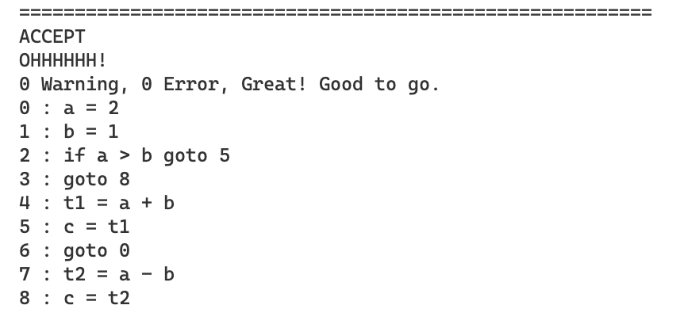
但由于该文法具有而二义性，所以在某些情况下会出现报错，在那些未判定的情况下会调用编译系统的错误处理函数让用户选择如何进行处理

### 总结反思

由于本次实验时间较紧，没有领悟到编译系统真正生成可执行代码的精髓，以后还需继续学习。
在完成实验的过程中，首先是文法的二义性特殊判定，由于文法不完善，需要很多的特判和额外符号扩充加入，导致了文法的臃肿和逻辑混乱，以后需要改进。并且由于熟练程度不足，导致编码效率过低，还需要多写代码多实践，提高自己的技术力。